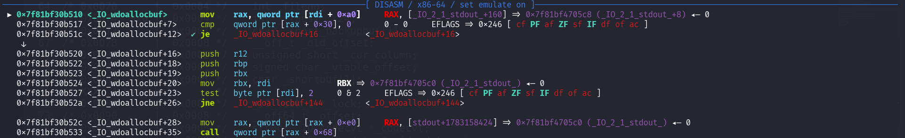
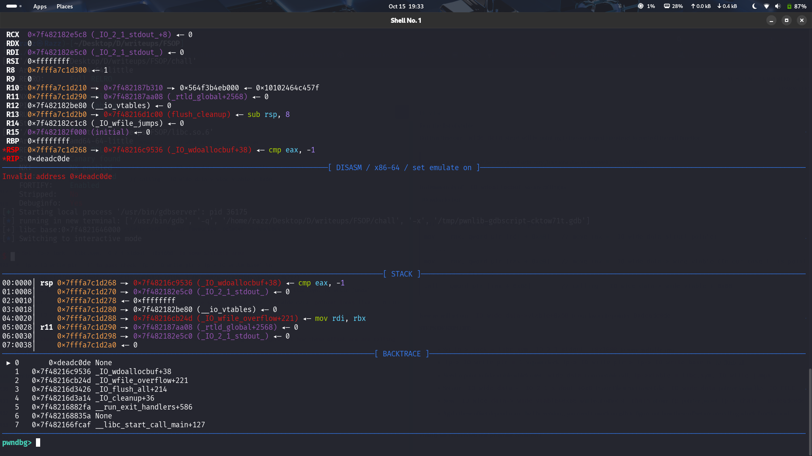

# Introduction

I'M going to explain you the  File Stream Oriented Programming `FSOP` exploitation in very beginner friendly way , at least i would try.
The motivation for this writeup is due to those friends , who knows very much basic ROP , But afraid of this topic because they think File struct is just an Advance Exploitation and require more details to learn about File Structure of C And mostly they are confused in how FSOP work.
So i am going to explain those low-level details in very raw format . My main focus would be always on the reason of why this is happening rather than what would happen ./?
I would start from the exit() function , because this is the best way to exploit if no other printf, scanf, etc. function is unavailable..

In this writeup i followed these binary files taken from `Securinets CTF` ,:
Challenge file : [chall](https://github.com/Rahulrajln1111/Writeups/blob/main/FSOP/chall) #I modified this binary to make it easy to follow  

libc (non-stripped) : [libc](https://github.com/Rahulrajln1111/Writeups/blob/main/FSOP/libc.so.6)  

linker:[ld](https://github.com/Rahulrajln1111/Writeups/blob/main/FSOP/ld-linux-x86-64.so.2)  

detailed exploit:[exploit](https://github.com/Rahulrajln1111/Writeups/blob/main/FSOP/solve.py) 


_Start:
---
```c
void
exit (int status)
{
__run_exit_handlers (status, &__exit_funcs, true, true);
}
```

* After End of main() function , our program call `exit()-->__run_exit_handlers()`

## 1. Inside exit_handlers
---
 

```c
void
attribute_hidden
__run_exit_handlers (int status, struct exit_function_list **listp,
bool run_list_atexit, bool run_dtors)
{
...
while (true)
{
...
}
while (cur->idx > 0)
{
struct exit_function *const f = &cur->fns[--cur->idx];
const uint64_t new_exitfn_called = __new_exitfn_called;
switch (f->flavor)
{
.....

}
....
__libc_lock_unlock (__exit_funcs_lock);
if (run_list_atexit)
call_function_static_weak (_IO_cleanup);//This is our target function to trace for File stream flush operations..
_exit (status);
}
```
Full exit.c code : [exit.c](https://elixir.bootlin.com/glibc/glibc-2.40.9000/source/stdlib/exit.c)

 `_IO_cleanup() purpose:`
* This function is part of glibc’s internal I/O system (libio).
* It is called at program termination (via exit() or similar paths) to:
* flush all open standard I/O streams (stdout, stderr, file streams, etc.)
* Make sure any buffered data is written to files.
* Switch streams to unbuffered mode afterward.

```c
int
IOcleanup (void)
{
  int result = IOflush_all (); 
  IOunbuffer_all ();
  return result;
}
```
` int result = _IO_flush_all ();`
*  calls `_IO_flush_all()`, which:
* Iterates over all open FILE* objects.
* Flushes (writes out) any data still in their buffers.
* Returns a result code (typically 0 for success, non-zero for failure).

` _IO_unbuffer_all ();`
  * This function iterates over all open FILE* streams and sets their buffering mode to unbuffered (like calling    setbuf(stream, NULL) for each).


## 2. _IO_FILE_plus:

---
Before moving forward to `_IO_flush_all` we need to do some discussion on `_IO_FILE_plus`.....
  What is `_IO_FILE_plus` ? ?
  
 In user-level C code, you typically see streams as:
 ```
 FILE *fp = fopen("data.txt", "w");
 ```
 But internally in glibc, a FILE is implemented as a struct defined in [source/libio/bits/types/struct_FILE.h](https://elixir.bootlin.com/glibc/glibc-2.42/source/libio/bits/types/struct_FILE.h)
 ```c
struct _IO_FILE {
    int _flags;                // File status flags (read/write/eof/error)
    char *_IO_read_ptr;        // Current read pointer in the buffer
    char *_IO_read_end;        // End of readable buffer
    char *_IO_read_base;       // Start of readable buffer
    char *_IO_write_base;      // Start of write buffer
    char *_IO_write_ptr;       // Current write pointer
    char *_IO_write_end;       // End of write buffer
    char *_IO_buf_base;        // Base of allocated buffer (for read/write)
    char *_IO_buf_end;         // End of allocated buffer
    char *_IO_save_base;       // Backup of buffer base (used in ungetc)
    char *_IO_backup_base;     // Backup buffer base
    char *_IO_save_end;        // Backup buffer end
    struct _IO_marker *_markers;  // Linked list of markers (used for positioning)
    struct _IO_FILE *_chain;      // Next FILE in linked list of open streams
    int _fileno;               // File descriptor (OS handle)
    int _flags2 : 24;          // Extra flags for internal use
    char _short_backupbuf[1];  // Tiny backup buffer for special cases
    __off_t _old_offset;       // Previous file offset (for seek operations)
    unsigned short _cur_column;// Current column number (for text streams)
    signed char _vtable_offset;// Offset of vtable pointer in object (0 for normal FILE)
    char _shortbuf[1];         // Tiny buffer for putc/ungetc
    _IO_lock_t *_lock;         // Lock for thread-safe access
    __off64_t _offset;         // Current file position (64-bit offset)

    // Wide character support
    struct _IO_codecvt *_codecvt;  // Codecvt object for character conversion (wide char support)
    struct _IO_wide_data *_wide_data; // Buffer and state for wide-character I/O
    struct _IO_FILE *_freeres_list;    // List of freed FILE objects (for cleanup)
    void *_freeres_buf;                // Buffer used for freeing FILEs
    struct _IO_FILE **_prevchain;      // Previous FILE in the global chain
    int _mode;                          // Stream orientation: 0 = undecided, >0 = wide, <0 = byte
    char _unused2[20];                  // Padding / reserved for future use
};

//Finally
struct _IO_FILE_plus
{
  FILE file;
  const struct _IO_jump_t *vtable;
};
```
 Do not get afraid of these whole entries 😅  , for our exploit part we need to just focus more on these entries:
 * ` _chain`
 * `_lock`
 * `_wide_data`
 * `_mode`
 * `_IO_jump_t *vtable`  [This one is most important..]
 * Apart from the above entries we would need to understand some char * of `read`,`write`,`buf`,`save`,`backup`..

So when we call fopen to open our file it basically do some initialization of these file struct like 
```c
fopen()  
 └── _IO_new_fopen()  
      └── _IO_new_file_fopen()  
           ├── _IO_file_open()     ← does low-level open() syscall
           ├── _IO_file_init()     ← initializes vtable & buffering
           └── returns _IO_FILE_plus object  // this is our struct file
```
##### `_chain:`

Let's say you opened two files named `file1.txt` and `file2.txt` , then 
On opening any of these file we receive a `_IO_FILE_plus`  struct  containing `_fileno` entries with the file descriptor returned by kernel i.e if i open `file1.txt` first then `_fileno=3 ` and then open `file2.txt` then its `_fileno=4`.
Now , we will observe that `_chain` entries of both file would be different...
Before moving to `_chain` I would like to introduce you with a very famous pointer , I m calling him famous because It is a global pointer inside glibc’s libio layer named `_IO_list_all`.  
  
  

###### `_IO_list_all:`
* It points to the head of a linked list of all currently active (open) FILE* streams.
*  It’s essential for process cleanup because it contain list of of all opened  file pointer
* Initially it contain  ```_IO_list_all → _IO_2_1_stderr_ (fd=2)``` , as we open any other file it is added in the head of  `_IO_list_all` like ```_IO_list_all → OurFile_pointer(fd=3)``` 

In last point as I told you each new file opened is connected to head of `_IO_list_all` but what about previously connected file pointer and how `_IO_list_all` is going to connect those all files ??
These doubts will now connect us with the use of `_chain` entries  because this `_chain` entries do nothing but contain the entries of pointer which was connected to the head of `_IO_list_all` before currently opened file Or we can say that entries of `OurFile_pointer(fd=3)->_chain` will be pointer to `_IO_2_1_stderr_(fd=2)` ,

* `_IO_2_1_stderr_(fd=2)->_chain =  _IO_2_1_stdout_(fd=1)` 
* `_IO_2_1_stdout_(fd=1)->_chain =  _IO_2_1_stdin_(fd=0)`
* `_IO_2_1_stdin_(fd=0)->_chain =  NULL`
> Observation: `FD(n)->_chain = FD(n-1)` each file pointer  `_chain` contain previously opend file pointer

##### `_lock:`
To understand this entries , first think **why do we need this one ?**
Since we are dealing with Files , which mean it has to do something with read and write also in this modern era we have very fast computers or CPU right ?
These speed are due to multiple cpu or multiple threads , this is the case where we need to understand the importance of file operations under the condition of multiple thread who want to read or write the same file without any race condition..
So to avoid these race condition , we need to implement mutual exclusion or mutex locking system to avoid wrong result by locking  our file resources to be used by only one thread at once and wait by others.
* These implementation to avoid race conditon is done by setting our `_lock` with the mutex object
* `_lock` is either set to `NULL` or writable 

```c
pwndbg> p *(pthread_mutex_t *)stdout->_lock
$9 = {
  __data = {
    __lock = 0,
 ...
}
```
*   Thsese are mutex  pointer in stdout
##### `_wide_data:`
Whenever you write C , python code ,etc. you generally follow ASCII character , nothing new in it .. But while you are chatting with someone , it is not necessary that you always type in ASCII , sometime you need to show your emotion with some emoji , but **have you ever wondered how much emoji your phone have and How ASCII can represent more than 255+ emojis ?**

Again we can't represent those emojis with just `0xff` or `1 byte` limited ASCII  values we need something more to represent it .
There comes our `_wide_data` to manage those extra sized character.

* `_wide_data` is a pointer to a separate structure that stores buffers, pointers, and state for wide-character I/O.
* Regular char I/O (like fwrite) uses `_IO_write_base` / `_IO_write_ptr` / `_IO_buf_base`
* Wide wchar_t I/O uses `_wide_data->_IO_write_base` / `_IO_write_ptr` / `_IO_buf_base`.

##### `_mode:`
By reading it someone might misinterpret it like mode of file for read, write, truncate, etc.. But
The `_mode` field does not represent read/write mode — **It represents the character orientation of the file stream (whether it handles `normal bytes` or `wide characters`)**
Now you can connect with the above `_wide_data` , how our regular I/O uses is using `_IO_writ_base` and wide mode uses `_wide_data->_IO_write_base`
* `_mode` indicates whether the stream is `byte-oriented`, `wide-oriented`, or not yet decided.
* It helps glibc determine whether to use normal I/O buffers (`_IO_write_ptr`, `_IO_read_ptr`) or wide-character buffers (`_wide_data->_IO_write_ptr`, `_wide_data->_IO_read_ptr`).
* The _mode field is signed int: 
    * `0`→ orientation not yet determined (stream unused or undecided)
    * `>0`→ byte-oriented stream (used by `printf`, `fread`, etc.)
    * `<0` → wide-character-oriented stream (used by `fwprintf`, `fgetwc`, etc.)

##### `_IO_jump_t *vtable:`
This is the most important field if you want to understand how `_IO_FILE_plus` implements polymorphic behavior for all kinds of `I/O` operations.
`vtable ` basically contain table of fuctions which would be called via `_IO_OVERFLOW(fp, EOF);` according to which function is using this file struct i.e when you call `fwrite(fp):`  it is redirected to 
```fp->vtable->xsputn(fp, buf, n);```
* `vtable   ` is  like a menucard of function that our File is allowed to do.
* Without `vtable`, glibc would need if/else checks for every stream type.

```c
struct _IO_jump_t {
    size_t __dummy;               // placeholder, not used
    size_t __dummy2;              // placeholder, not used
    _IO_finish_t __finish;        // called when finishing stream (cleanup buffers)
    _IO_overflow_t __overflow;    // called when writing to a full buffer
    _IO_underflow_t __underflow;  // called when reading from empty buffer
    _IO_underflow_t __uflow;      // called to read a single character
    _IO_pbackfail_t __pbackfail;  // called when ungetc fails (pushing back char)
    _IO_xsputn_t __xsputn;        // called to write n bytes (fwrite uses this)
    _IO_xsgetn_t __xsgetn;        // called to read n bytes (fread uses this)
    _IO_seekoff_t __seekoff;      // called to seek by offset (fseek)
    _IO_seekpos_t __seekpos;      // called to seek to a specific position
    _IO_setbuf_t __setbuf;        // called to set buffering mode (setvbuf)
    _IO_sync_t __sync;            // called to flush buffers (fflush)
    _IO_doallocate_t __doallocate;// called to allocate internal buffer if needed
    _IO_read_t __read;            // low-level read (OS read)
    _IO_write_t __write;          // low-level write (OS write)
    _IO_seek_t __seek;            // low-level seek (lseek wrapper)
    _IO_close_t __close;          // low-level close (fclose wrapper)
    _IO_stat_t __stat;            // get file status (fstat)
    _IO_showmanyc_t __showmanyc;  // estimate number of characters available to read
    _IO_imbue_t __imbue;          // set locale/encoding (for wide-char streams)
};
```
## 3. Now move Inside _IO_flush_all()
---
After learning lots about File struct , we are now confident to understand the code below
What does `_IO_flush_all` do :
* Lock `_IO_list_all` --> for thread-safety (Multiple threads might be writing to different streams; we don’t want to flush while someone else is modifying one.)
* It walks the linked list `_IO_list_all`
* For each stream:
    * Check if there’s buffered data ( uses `_mode` to identify , if we need to flush `_wide char` or `normal bytes` )
    * Flush via _IO_OVERFLOW(fp, EOF)
* Handle errors (set result = EOF)
* Unlock global list
* Return success/failure

There is a new entry where you may feel new i.e. `_IO_vtable_offset(fp) == 0`  , This condition checks whether the FILE object `fp` is a standard/normal FILE stream, meaning its vtable pointer is located at the expected position (offset 0) in memory. If not 0 then our file stream is custom like `FILE *fp = fmemopen(buf, sizeof(buf), "w");` , but we generally do not use these standard unless we requir more customize form..
So, As our current writup we would assume for standared file stream for `open`, `fopen`, etc.
```c
int
_IO_flush_all (void)
{
  int result = 0;
  FILE *fp;

#ifdef _IO_MTSAFE_IO
  _IO_cleanup_region_start_noarg (flush_cleanup);
  _IO_lock_lock (list_all_lock); //lock global list all
#endif

  for (fp = (FILE *) _IO_list_all; fp != NULL; fp = fp->_chain) // started loop to scan all opened file pointer via the concurrent process
    {
      run_fp = fp;
      _IO_flockfile (fp); //lock the file to avoid race condition via another thread

      if (((fp->_mode <= 0 && fp->_IO_write_ptr > fp->_IO_write_base)  //  checking for normal byte or not decided and then checking if we are in mid of writing or not , if we are then need to flush it before end of main thread
     || (_IO_vtable_offset (fp) == 0 //checking for standared stream file pointer 
         && fp->_mode > 0 && (fp->_wide_data->_IO_write_ptr
            > fp->_wide_data->_IO_write_base)) // again checking for any pending _wide_data (_mode>0) buffer
     )
    && _IO_OVERFLOW (fp, EOF) == EOF) //do flush if any pending buffer ## This is our target now to explore..
  result = EOF; 

      _IO_funlockfile (fp); //unlock the file pointer to be used by another thread
      run_fp = NULL;
    }

#ifdef _IO_MTSAFE_IO
  _IO_lock_unlock (list_all_lock);
  _IO_cleanup_region_end (0);
#endif

  return result;
}
```
Code:[_IO_flush_all](https://elixir.bootlin.com/glibc/glibc-2.40.9000/source/libio/genops.c#L712)

## 4. _IO_OVERFLOW (fp, EOF)
---

In [libioP.h](https://elixir.bootlin.com/glibc/glibc-2.42.9000/source/libio/libioP.h#L148) , It defined as macros `#define _IO_OVERFLOW(FP, CH) JUMP1 (__overflow, FP, CH)`  and for `JUMP1` defined as
`#define JUMP1(FUNC, THIS, X1) (_IO_JUMPS_FUNC(THIS)->FUNC) (THIS, X1)`
Now we need to understand `_IO_JUMPS_FUNC(THIS)`  
It is again defined as macros in  [libioP.h](https://elixir.bootlin.com/glibc/glibc-2.42.9000/source/libio/libioP.h#L109) as :
```c
# define _IO_JUMPS_FUNC(THIS) \
  (IO_validate_vtable                                                   \ 
   (*(struct _IO_jump_t **) ((void *) &_IO_JUMPS_FILE_plus (THIS) \
           + (THIS)->_vtable_offset)))
```
* `THIS` is a pointer to a FILE object (`FILE *fp`)
* `_IO_JUMPS_FILE_plus(THIS)` , This is another macro/function (glibc internal) that gives the base memory address where the vtables for files are stored
* `+ (THIS)->_vtable_offset` , we already discussed it  ; shoud be  = `0` ;
* `_IO_jump_t *vtable = *(struct _IO_jump_t **)vtable_addr;`  assign `*vtable` the base address of `fp->vtable`.
* `vtable = IO_validate_vtable(vtable);` // this is an important step to verify the correctness of `vtable` pointer.
* Now `_IO_JUMPS_FUN(THIS)` will be replaced by `vtable` pointer  and `JUMP1(THIS,X1)` will call `(vtable->FUNC)(THIS,X1)`
* `FUNC` is offset of `vtable` functions based on verstion of libc. I'm testing on libc. 2.4 where `FUN = 3` for `__overflow` or `call [vtable+0x18]`  with 1 extra argument `x1` according to `JUMP1`

Now In our journey we reached upto `_IO_file_overflow` via `exit()->__run_exit_handlers()->_IO_cleanup()->_IO_flush_all()->_IO_file_overflow()`

Moving to next journey.. 📈 

# Finally !!, Exploitation 
---
Till now we reached upto `call [vtable+0x18]` , if you observer in `vtable` it is `__overflow` at offset `0x18`
This is the core function glibc uses for flushing/writing to a file when the buffer is full. 

* [_IO_new_file_overflow()](https://elixir.bootlin.com/glibc/glibc-2.42.9000/source/libio/fileops.c#L765) offset:0x18
1. _IO_file_overflow() handles overflow in a FILE stream’s buffer.
   * In `C`, when we write to a `FILE *` stream `(fputc, fwrite, fprintf, etc.)`, the data usually goes to a buffer in memory first.
   * The buffer is `flushed` (written to the underlying file descriptor or `_filno`) when it’s full or when you call `fflush()`.


But now our main focus is on, **What if we are able to write this `vtable` pointer ??**
>I have added challenge file which will allow us to take input directly to file pointer

In this challenge we are able to take input uputo `0xff bytes` , to overwrite file struct 
Now , think what can we over-write  to vtable pinter ??
If we remember , while Jumping to `_IO_OVERFLOW(FP, CH)` we have to pass throug a vtable check [`IO_validate_vtable(vtable)`](https://elixir.bootlin.com/glibc/glibc-2.42.9000/source/libio/libioP.h#L1033)
```c
IO_validate_vtable (const struct _IO_jump_t *vtable)
{
  uintptr_t ptr = (uintptr_t) vtable;
  uintptr_t offset = ptr - (uintptr_t) &__io_vtables; // in above case we were at offset 0x18 to call __Overflow
  if (__glibc_unlikely (offset >= IO_VTABLES_LEN)) // IO_VTABLE_LEN = sizeof(struct _IO_jump_t)
    _IO_vtable_check (); //cause error if failed to check
  return vtable; 
}
```
Inside `_IO_validate_vtable` it checks for our offset of `vtable` functions , it cannot allow us to call those functions which are not inside  `_IO_jump_t` struct i.e. our pointer `*vtable`.

>It looks like we stuck here ?

So we need to pass a valid `vtable` pointer which can call some vulnerable function whose calling function can be controlled by our forged file struct.
There is a separate type `vtable` for wide char flush operation that uses our [wide_data struct](https://elixir.bootlin.com/glibc/glibc-2.42/source/libio/libio.h#L121)  (we already have a small discussion on this ) entry of our forged file pointer.
This special `vtable` for wide char is `_IO_wfile_jump` , its pointer lies in [`__io_vtable`](https://elixir.bootlin.com/glibc/glibc-2.42.9000/source/libio/libioP.h#L519) so we can use this to call the function related to wide char operations.

After over-writing our vtable with `_IO_wfile_jump`  our `call [vtable+0x18]` will now call `_IO_wfile_overflow` to manage wide char instead of `__overflow` for normal bytes.

Now look inside [_IO_wfile_overflow](https://elixir.bootlin.com/glibc/glibc-2.42.9000/source/libio/wfileops.c#L407)
```c
wint_t
_IO_wfile_overflow (FILE *f, wint_t wch)
{
  if (f->_flags & _IO_NO_WRITES) /* SET ERROR */
    {
      f->_flags |= _IO_ERR_SEEN;
      __set_errno (EBADF);
      return WEOF;
    }
  /* If currently reading or no buffer allocated. */
  if ((f->_flags & _IO_CURRENTLY_PUTTING) == 0
      || f->_wide_data->_IO_write_base == NULL)
    {
      /* Allocate a buffer if needed. */
      if (f->_wide_data->_IO_write_base == NULL) 
  {
    _IO_wdoallocbuf (f); // This is now our target function to call
    _IO_free_wbackup_area (f);

    if (f->_IO_write_base == NULL)
      {
        _IO_doallocbuf (f);
        _IO_setg (f, f->_IO_buf_base, f->_IO_buf_base, f->_IO_buf_base);
      }
    _IO_wsetg (f, f->_wide_data->_IO_buf_base,
         f->_wide_data->_IO_buf_base, f->_wide_data->_IO_buf_base);
  }
  ...
```

`_IO_wdoallocbuf()` ensure the `FILE` stream f has an appropriate buffer for wide-character operations (wchar/wide I/O).
```c
_IO_doallocbuf (FILE *fp)
{
  if (fp->_IO_buf_base) // checks if buff is already allocated
    return;
  if (!(fp->_flags & _IO_UNBUFFERED) || fp->_mode > 0) //This checks whether the stream is buffered. If the _IO_UNBUFFERED flag is not set, the stream is intended to use a buffer and therefore we should try to allocate one
    if (_IO_DOALLOCATE (fp) != EOF) // it is responsible for  actual work of allocating and installing a buffer for a FILE *
      return;
  _IO_setb (fp, fp->_shortbuf, fp->_shortbuf+1, 0);
}
```

We will now focus on `_IO_DOALLOCATE`  :
* It is implemented as macros `#define _IO_WDOALLOCATE(FP) WJUMP0 (__doallocate, FP)`in [libioP.h](https://elixir.bootlin.com/glibc/glibc-2.42.9000/source/libio/libioP.h#L225) same as we discussed `JUMP1` above.
* `#define WJUMP0(FUNC, THIS) (_IO_WIDE_JUMPS_FUNC(THIS)->FUNC) (THIS)` 
* `#define _IO_WIDE_JUMPS_FUNC(THIS) _IO_WIDE_JUMPS(THIS)`
```c
#define _IO_WIDE_JUMPS(THIS) \
  _IO_CAST_FIELD_ACCESS ((THIS), struct _IO_FILE, _wide_data)->_wide_vtable
```
From the above points , we can conclude that how we are using `_wide_data->_wide_vtable` pointer same as `fp->vtable` to call the required function form the list of vtable.
But this time our `_wide_data` struct will be pointing to the our forged File struct to controll the call function 
> Note : This time we will be able to call arbitrary functions due to no check for valid vtable.

In disassembly of `_IO_wdoallocbuf` we are calling as 

```c 
rdi = _IO_2_1_stdout struct pointer
mov    rax, qword ptr [rdi + 0xa0]   // move rax = _IO_wide_data struct pointer
   ...
mov    rax, qword ptr [rax + 0xe0]   // move rax = _IO_wide_data->_wide_vtable (In our case it is pointing to our File Struct)
call   qword ptr [rax + 0x68]        // calling  _IO_wide_data->_wide_vtable + 0x68 
```


Now we will set our `_IO_wide_data->vtable+0x68` to our favourite  pointer `0xdeadc0de`  
  

**STEPS OF EXPLOIT:**
* Set `fp->_lock = libc.sym._IO_2_1_stdout_ +0x1000` to some writable area 
* `fp->_IO_write_ptr = 1` to pass check `fp->_IO_write_ptr > fp->_IO_write_base` in [_IO_flush_all](https://elixir.bootlin.com/glibc/glibc-2.40.9000/source/libio/genops.c#L727)
* Need to point to fake vtable which uses `_wide_data` to vulnerable call . `fp->vtable = libc.sym._IO_wfile_jumps` 
* Set our `_IO_wide_data` = `_IO_2_1_stdout +0x8` in our File struct to set fake `_IO_wide_data` pointer looks like `_IO_FILE`
* Now `_IO_wide_data->_wide_vtable+0x68` will be at offset of `_chain` of our `fp` pointer , so set `fp->_chain` = `0xdeadc0de`
* Again these offset depend upon the libc version. , you need to work on gdb to figure out how these offset are are calling which function and where.


**Finally we controlled our program counter!!** .

***Thanks for Reading!!***


